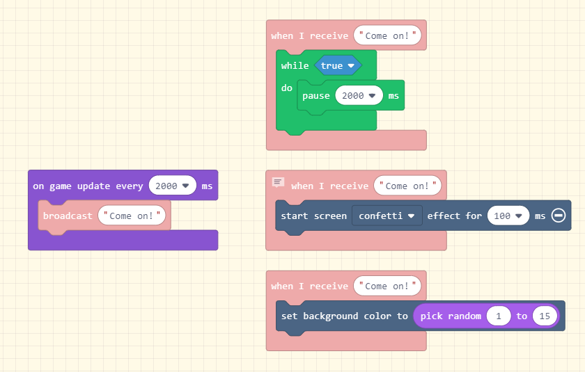

# pxt-boardcast

## Description:

The same usage, just like you did in the Scratch.mit.edu. 

Send Message out with "Broadcast (...)" block, when a some state happened. And enbrace some dealing blocks/codes with "When I receive (...)" block. See "Testing and Use" below.

## Features:
* More than one Receiving event block at same time
* And they running in Parallel, wouldn't blocking each others.

## Testing and Use:

## next:
- [ ] Support micro:bit (makecode.microbit.org) at same time.
- [ ] Add "Broadcast (...) and wait block".
- [ ] category icon

## TODO

- [ ] Add a reference for your blocks here
- [x] Add "icon.png" image (300x200) in the root folder
- [x] Add "- beta" to the GitHub project description if you are still iterating it.
- [ ] Turn on your automated build on https://travis-ci.org
- [ ] Use "pxt bump" to create a tagged release on GitHub
- [ ] On GitHub, create a new file named LICENSE. Select the MIT License template.
- [ ] Get your package reviewed and approved https://arcade.makecode.com/extensions/approval

Read more at https://arcade.makecode.com/extensions

## Supported targets

* for PXT/arcade
(The metadata above is needed for package search.)

